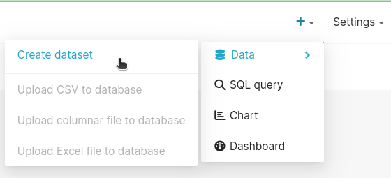
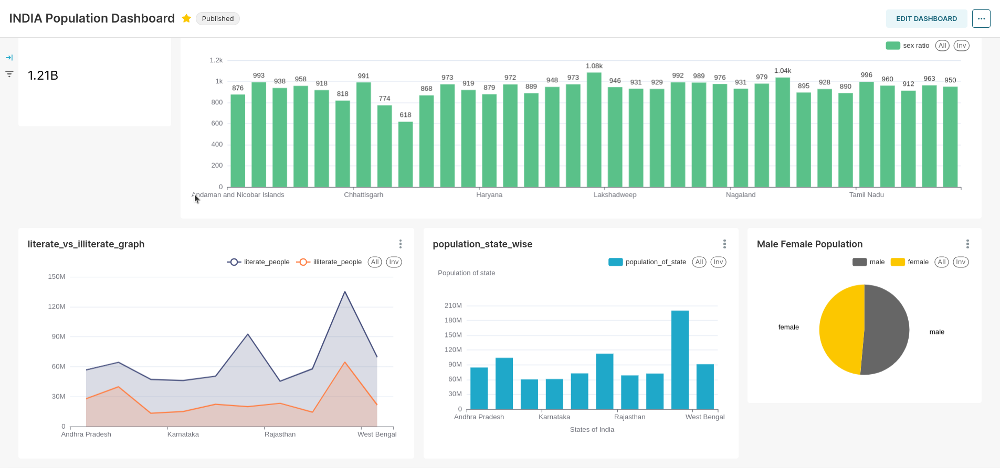

### How TO And prerequisite

Docker and docker-compose 

```bash 
docker-compose up -d
```
Go TO [Dashboard URL](http://0.0.0.0:9041/superset/welcome/)

### Postgres Connection

Go to create dataset then data



### DashBoard

Dashboard UI

