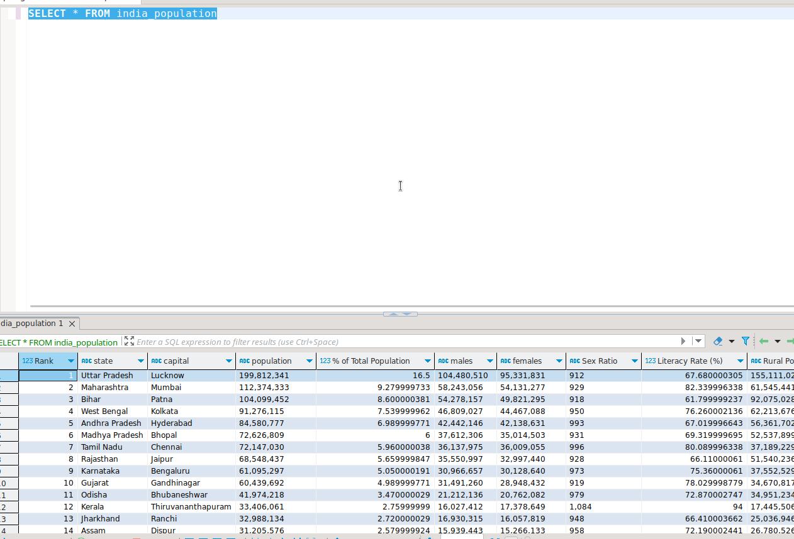

### How TO And prerequisite

Docker and docker-compose 

```bash 
docker-compose up -d
```
Go TO [Dashboard URL](http://0.0.0.0:9041/superset/welcome/)

### Link for Dataset

Populate this csv in Postgres DB 

https://github.com/TheMrityunjayPathak/IndiaPopulationAnalysis/blob/main/india_population.csv





### DashBoard

Dashboard UI

